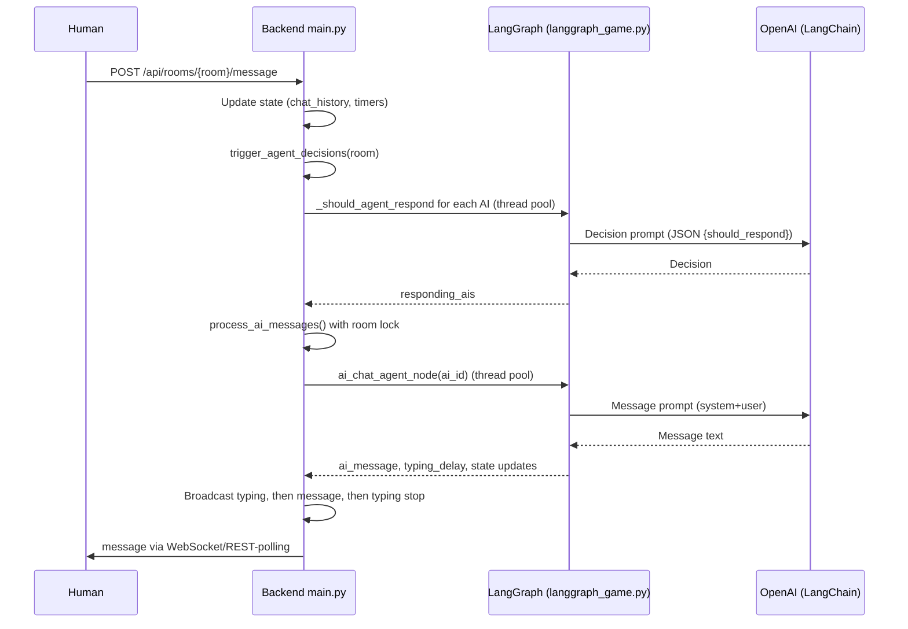

### Backend AI Agents — Architecture and Flow

This document explains how the AI agents are implemented in the backend, how they make decisions and generate messages, and how the system orchestrates agents concurrently during gameplay.

---

## High-level Overview

- **Frameworks**: FastAPI for transport + LangGraph for multi-agent/state orchestration + LangChain OpenAI for LLM calls.
- **Core files**: `backend/main.py` (server, concurrency, orchestration glue), `backend/langgraph_game.py` (graph, agent nodes, AI generation), `backend/langgraph_state.py` (state schema), `backend/config.py` (tuning), legacy (`backend/ai_legacy.py`, `backend/game_legacy.py`).
- **Concurrency model**: Async FastAPI with per-room locks + background tasks. LLM calls run in a thread pool via `run_in_executor` to avoid blocking the event loop.
- **Phases**: Discussion → Voting → Elimination → Check Win → New Round or Game Over.

---

## StateGraph (LangGraph) — Nodes and Edges

The LangGraph `StateGraph` wires up nodes for each phase and agent action.

```49:60:backend/langgraph_game.py
        # Add nodes
        workflow.add_node("initialize_game", self.initialize_game_node)
        workflow.add_node("discussion_phase", self.discussion_phase_node)
        workflow.add_node("ai_chat_agent", self.ai_chat_agent_node)
        workflow.add_node("voting_phase", self.voting_phase_node)
        workflow.add_node("ai_vote_agent", self.ai_vote_agent_node)
        workflow.add_node("elimination", self.elimination_node)
        workflow.add_node("check_win_condition", self.check_win_condition_node)
        workflow.add_node("new_round", self.new_round_node)
        workflow.add_node("game_over", self.game_over_node)
```

Key routing logic:

```65:89:backend/langgraph_game.py
        # Add edges
        workflow.add_edge("initialize_game", "discussion_phase")
        workflow.add_edge("discussion_phase", "ai_chat_agent")

        # Conditional routing after AI chat
        workflow.add_conditional_edges(
            "ai_chat_agent",
            self.should_continue_discussion,
            {
                "continue": "ai_chat_agent",
                "voting": "voting_phase"
            }
        )

        workflow.add_edge("voting_phase", "ai_vote_agent")

        # Conditional routing after AI voting
        workflow.add_conditional_edges(
            "ai_vote_agent",
            self.should_continue_voting,
            {
                "continue": "ai_vote_agent",
                "eliminate": "elimination"
            }
        )
```

And final phase routing:

```91:105:backend/langgraph_game.py
        workflow.add_edge("elimination", "check_win_condition")
        workflow.add_conditional_edges(
            "check_win_condition",
            self.check_game_status,
            {
                "continue": "new_round",
                "game_over": "game_over"
            }
        )
        workflow.add_edge("new_round", "discussion_phase")
        workflow.add_edge("game_over", END)
```

---

## Game State Schema

`GameState` is the single source of truth for gameplay plus agent coordination.

```34:79:backend/langgraph_state.py
class GameState(TypedDict):
    """
    Complete game state for LangGraph.
    
    This state is passed through all nodes in the graph and can be updated
    by any node. Use Annotated with operator.add for lists to append rather
    than replace.
    """
    # Game metadata
    room_code: str
    round: int
    phase: Phase
    num_ai_players: int
    
    # Players
    players: List[PlayerInfo]
    
    # Chat and communication
    chat_history: Annotated[List[ChatMessage], operator.add]
    
    # Current round topic
    topic: str
    
    # Voting
    votes: Dict[str, str]  # voter_id -> voted_for_id
    
    # AI-specific data
    ai_personalities: Dict[str, str]
    pseudonym_map: Dict[str, str]
    human_external_name: str
    
    # Timing
    last_message_time: float
    round_start_time: float
    
    # Game outcome
    winner: Optional[Literal["human", "ai"]]
    eliminated_player: Optional[str]
    
    # Pending actions (for async coordination)
    pending_ai_messages: List[str]
    pending_ai_votes: List[str]
    
    # WebSocket broadcast queue (messages to send to frontend)
    broadcast_queue: Annotated[List[Dict], operator.add]
```

Notes:
- `ai_personalities` controls persona per agent.
- `human_external_name` maps the human to a visible name (e.g., "Player 5") — agent prompts never use P1/P2 labels.
- `pending_ai_messages`/`pending_ai_votes` coordinate who still needs to act.

---

## AI Decision and Messaging

There are two key agent behaviors during discussion and voting.

1) Should an agent respond now?

```415:493:backend/langgraph_game.py
    def _should_agent_respond(self, state: GameState, ai_id: str) -> bool:
        """
        Determine if an AI agent should respond to the current conversation state.
        Uses LLM to make an active decision based on conversation context.
        """
        # ... builds visible history, participation stats, avoids back-to-back speaking ...
        messages = [HumanMessage(content=system_prompt)]
        try:
            response = self.llm.invoke(messages)
            decision_data = json.loads(response.content)
            should_respond = decision_data.get("should_respond", False)
            # ...
            return should_respond
        except (json.JSONDecodeError, KeyError, Exception) as e:
            # Fallback: 30% probability
            return random.random() < 0.3
```

2) Generate the agent’s message:

```494:549:backend/langgraph_game.py
    def _generate_ai_message(self, state: GameState, ai_id: str) -> str:
        """
        Generate a chat message for an AI agent using LangChain.
        Uses visible player names exactly as they appear in the chat (e.g., "You", "Player 1").
        """
        # ... builds visible history, anchors to topic if needed ...
        messages = [
            SystemMessage(content=system_prompt),
            HumanMessage(content=user_prompt)
        ]
        try:
            response = self.llm.invoke(messages)
            return response.content
        except Exception:
            return "I agree with that!"
```

Voting logic mirrors this with `_generate_ai_vote` using JSON output and mapping visible names back to real IDs.

---

## Orchestration and Concurrency (FastAPI glue)

FastAPI orchestrates rooms, runs AI work in background, and prevents duplicates/races with locks.

- After human messages or periodic checks, agents decide and respond concurrently.
- A per-room `asyncio.Lock` prevents duplicate task creation.
- A `ThreadPoolExecutor` is used for blocking LLM calls to avoid blocking the event loop.

Triggering and processing AI messages:

```456:503:backend/main.py
async def process_ai_messages(room_code: str):
    # ...
    async with room_locks[room_code]:
        state = rooms[room_code]['state']
        pending_ais = state.get('pending_ai_messages', []).copy()
        processing_agents = rooms[room_code].get('ai_processing_agents', set())
        # ... mark processing and create tasks ...
        tasks = [
            asyncio.create_task(process_single_ai_message(room_code, ai_id))
            for ai_id in ais_to_process
        ]
    if tasks:
        await asyncio.gather(*tasks, return_exceptions=True)
```

Individual AI message handling (LLM in thread pool, typing indicators, broadcasts):

```314:361:backend/main.py
        result = await loop.run_in_executor(
            executor,
            lambda: game_graph.ai_chat_agent_node(state, ai_id=ai_id)
        )
        # ... update state ...
        if 'ai_sender' in result and 'ai_message' in result:
            await broadcast_to_room(room_code, {"type": "typing", ... "start"})
            await asyncio.sleep(typing_delay)
            await broadcast_to_room(room_code, {"type": "message", ...})
            await broadcast_to_room(room_code, {"type": "typing", ... "stop"})
```

Proactive engagement (avoid long silences) and decision triggers:

```95:129:backend/main.py
async def proactive_agent_engagement(room_code: str):
    # periodically check quiet time and trigger agent decisions
    if time_since_last > 10:
        asyncio.create_task(trigger_agent_decisions(room_code))
```

---

## Sequence Diagram — Discussion Turn



---

## Configuration

Relevant knobs in `backend/config.py` (model name/temp, cooldowns, topics, etc.) control pacing and flavor of agent behavior. The `MESSAGE_COOLDOWN` guards against rapid-fire agent messages; `ROUNDS_TO_WIN` controls when the human wins by eliminating enough AIs.

---

## Legacy Implementation (for reference)

The legacy `ai_legacy.py` used direct OpenAI calls and per-agent tasks without LangGraph’s state machine. The modern implementation consolidates logic in LangGraph nodes and uses FastAPI as the orchestrator with stronger race-condition and duplication protections.

---

## Key Takeaways

- Centralized `GameState` drives deterministic orchestration; nodes are pure functions returning new state fragments.
- Decisions and generations are LLM-backed and run off-thread.
- Concurrency is scoped per-room with locks and a processing set to prevent duplicates.
- The frontend (Streamlit or React) simply renders broadcasts/state and posts user intent.


