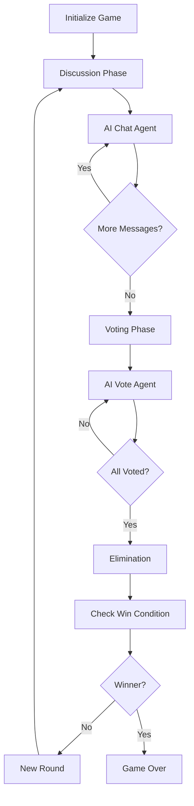

# LangGraph Migration Guide

## Overview
The Human Hunter game has been successfully migrated from direct OpenAI API calls to a LangGraph-based multi-agent architecture. This document explains the changes, benefits, and how to work with the new system.

## What Changed?

### Architecture Transformation
**Before**: Direct OpenAI API calls with imperative game logic
- `ai.py`: Handled all AI interactions with direct API calls
- `game.py`: Simple state management with basic classes
- Game flow controlled through callbacks and timers

**After**: LangGraph StateGraph with declarative multi-agent system
- `langgraph_game.py`: Complete graph-based orchestration
- `langgraph_state.py`: Comprehensive state schema
- `config.py`: Centralized configuration
- Game flow defined as a directed graph with nodes and edges

### Key Benefits

#### 1. **Scalability**
- **Configurable AI Count**: Easily adjust from 4 to 8+ AI agents via `NUM_AI_PLAYERS`
- **Dynamic Agent Creation**: Agents are created at runtime based on configuration
- **Resource Management**: Better handling of concurrent AI operations

#### 2. **State Management**
- **Immutable State Flow**: State changes are explicit and traceable
- **Complete History**: All game events stored in state
- **Debugging**: Easy to inspect state at any point in the graph

#### 3. **Modularity**
- **Independent Nodes**: Each game phase is a separate, testable node
- **Reusable Components**: Agent nodes can be easily modified or extended
- **Clear Separation**: Game logic separated from WebSocket handling

#### 4. **Extensibility**
- **New Agent Types**: Add different AI personalities or strategies
- **Custom Nodes**: Insert new game mechanics without breaking existing flow
- **Multi-Model Support**: Switch between OpenAI, Anthropic, etc.

## File Structure

```
backend/
├── config.py                    # Configuration and environment variables
├── langgraph_state.py          # State schema (GameState TypedDict)
├── langgraph_game.py           # LangGraph implementation
├── main.py                      # FastAPI + WebSocket integration
├── requirements.txt             # Updated dependencies
├── ai_legacy.py                 # Archived old AI handler
└── game_legacy.py              # Archived old game logic
```

## New Dependencies

```
langgraph               # Graph-based workflow orchestration
langchain               # LLM abstraction framework
langchain-openai        # OpenAI integration for LangChain
langchain-core          # Core LangChain utilities
```

Install with:
```bash
pip install -r requirements.txt
```

## Configuration Options

### Environment Variables

```bash
# AI Configuration
export NUM_AI_PLAYERS=4              # Number of AI agents (4-8+)
export AI_MODEL_PROVIDER="openai"    # openai, anthropic, groq
export AI_MODEL_NAME="gpt-4o-mini"   # Model name
export AI_TEMPERATURE=0.8            # LLM temperature

# Game Timing
export DISCUSSION_TIME=180           # Discussion phase (seconds)
export VOTING_TIME=60                # Voting phase (seconds)
export ROUNDS_TO_WIN=3               # Rounds to win

# API Keys
export OPENAI_API_KEY="your-key"
export ANTHROPIC_API_KEY="your-key"  # Optional
```

### config.py Modifications

You can also edit `backend/config.py` directly:

```python
NUM_AI_PLAYERS = 6  # Change from default 4 to 6 agents
AI_MODEL_NAME = "gpt-4"  # Upgrade to GPT-4
```

## How the Graph Works

### State Flow



### Node Descriptions

#### Initialize Game
- Creates initial game state
- Assigns AI personalities
- Sets up pseudonym maps for anonymity
- Broadcasts game start to frontend

#### Discussion Phase
- Activates discussion mode
- Selects subset of AIs to respond
- Manages message timing

#### AI Chat Agent
- Generates conversational responses
- Uses LangChain chat models
- Maintains personality consistency
- Pseudonymizes player identities

#### Voting Phase
- Transitions to voting
- Prepares AI agents to vote
- Clears previous votes

#### AI Vote Agent
- Analyzes chat history
- Generates strategic vote
- Returns structured vote decision

#### Elimination
- Counts votes
- Determines eliminated player
- Updates player status

#### Check Win Condition
- Checks if human eliminated (AI wins)
- Checks if 3 AIs eliminated (human wins)
- Returns winner or None

#### New Round
- Increments round counter
- Selects new topic
- Resets votes

#### Game Over
- Broadcasts winner
- Ends game session

## WebSocket Compatibility

The new system maintains **100% compatibility** with the existing frontend. All message types are preserved:

- `player_list`: Initial player list
- `topic`: Discussion topic
- `phase`: Phase changes
- `message`: Chat messages
- `typing`: Typing indicators
- `voted`: Vote confirmations
- `elimination`: Elimination results
- `game_over`: Game end
- `new_round`: Round transitions

## Migration Checklist

- [x] Update `requirements.txt` with LangGraph dependencies
- [x] Create `config.py` for centralized configuration
- [x] Create `langgraph_state.py` with GameState schema
- [x] Create `langgraph_game.py` with complete graph implementation
- [x] Update `main.py` to integrate LangGraph with FastAPI
- [x] Archive legacy files (`ai.py` → `ai_legacy.py`, `game.py` → `game_legacy.py`)
- [x] Update README.md with new architecture information
- [x] Maintain WebSocket message compatibility

## Testing the New System

### 1. Install Dependencies
```bash
cd backend
pip install -r requirements.txt
```

### 2. Set API Key
```bash
export OPENAI_API_KEY='your-api-key-here'
```

### 3. Run Backend
```bash
uvicorn main:app --reload
```

### 4. Test with Different Configurations
```bash
# Try with 6 AI players
export NUM_AI_PLAYERS=6
uvicorn main:app --reload

# Try with different model
export AI_MODEL_NAME="gpt-4"
uvicorn main:app --reload
```

## Extending the System

### Adding a New AI Personality

Edit `config.py`:
```python
AI_PERSONALITIES = [
    "slightly sarcastic",
    "very cheerful",
    "inquisitive",
    "quiet and observant",
    "enthusiastic",      # New!
    "analytical",        # New!
    "humorous",          # New!
    "philosophical"      # New!
]
```

### Adding a Custom Node

In `langgraph_game.py`:
```python
def custom_analysis_node(self, state: GameState) -> GameState:
    """Custom node for additional analysis."""
    # Your logic here
    return {
        "broadcast_queue": [{"type": "custom", "data": "..."}]
    }

# Add to graph in _build_graph()
workflow.add_node("custom_analysis", self.custom_analysis_node)
workflow.add_edge("discussion_phase", "custom_analysis")
```

### Using Different LLM Providers

The system is ready for multi-provider support. To add Anthropic:

```python
# In langgraph_game.py
from langchain_anthropic import ChatAnthropic

if AI_MODEL_PROVIDER == "anthropic":
    self.llm = ChatAnthropic(
        model=AI_MODEL_NAME,
        temperature=AI_TEMPERATURE
    )
```

## Troubleshooting

### Graph Not Progressing
- Check `pending_ai_messages` and `pending_ai_votes` in state
- Ensure conditional edge functions return correct values
- Verify WebSocket connections are active

### AI Responses Not Generating
- Verify API key is set correctly
- Check LangChain model initialization
- Look for errors in terminal output

### State Not Updating
- Ensure nodes return partial state updates
- Check that `operator.add` is used for list fields in TypedDict
- Verify broadcast_queue is being processed

### Frontend Disconnecting
- Check WebSocket message format matches expected schema
- Ensure all message types are handled
- Verify room management in `main.py`

## Performance Considerations

### Optimization Tips
1. **Parallel AI Generation**: Consider using `asyncio.gather()` for concurrent AI messages
2. **Caching**: Add LangChain caching for repeated prompts
3. **Model Selection**: Use faster models (gpt-4o-mini) for development
4. **Batch Operations**: Process multiple AI actions in single graph invocations

### Monitoring
- Track graph execution time
- Monitor API call counts
- Log state transitions for debugging

## Future Enhancements

Potential improvements enabled by LangGraph architecture:
- [ ] **Memory System**: Add LangChain memory for AI agents to remember past rounds
- [ ] **Tool Use**: Give AIs tools to analyze chat patterns
- [ ] **Checkpointing**: Save/load game state mid-game
- [ ] **Human-in-the-Loop**: Add manual intervention nodes
- [ ] **Multi-Model Ensemble**: Different AIs use different models
- [ ] **Advanced Strategies**: Implement coalition formation between AIs
- [ ] **Adaptive Difficulty**: Adjust AI intelligence based on human performance

## Support

For issues or questions:
1. Check terminal output for error messages
2. Verify all dependencies are installed
3. Ensure API keys are valid
4. Review state in debugger at each node
5. Consult LangGraph documentation: https://langchain-ai.github.io/langgraph/

## Conclusion

The LangGraph migration provides a robust, scalable foundation for the Human Hunter game. The graph-based architecture makes it easy to:
- Scale to more AI agents
- Add new game mechanics
- Support multiple LLM providers
- Debug and test game logic

The system maintains full backward compatibility while enabling future enhancements that would have been difficult with the previous architecture.

